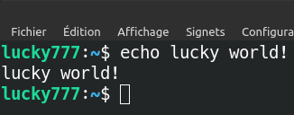
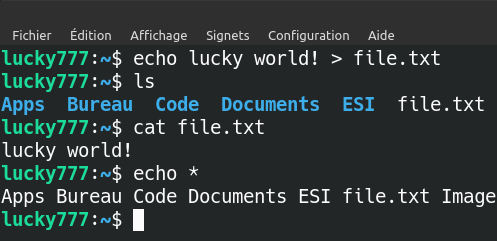
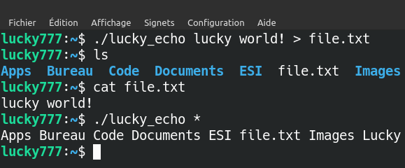

# SYS

# Espace disque

## File system

> Métadonnées qui définissent le formatage.<br>
C'est en quelque sorte la façon dont on organise les fichiers au sein d'un disque.<br>
ex: `EXT`(linux), `NTFS`(windows), `FAT`

## Partition

> Avant que son espace puisse être utilisé, un disque doit être divisé en partitions.<br>
Ce sont en quelque sorte des régions définies du disques.


<p style="color: darkgray; text-align: center">disque SSD et ses partitions</p>

On y voit principalement:
- Le disque SSD `/etc/nvme0n1` de `238.47 Gio`
- Une partition `nvme0np2` type `fat32` de `100 Mio` possédant le flag `boot`
- Une partition `nvme0np4` type `ntfs` de `155.38 Gio` sur laquelle est installé Windows
- Une partition `nvme0np7` type `ext4` de `81.34 Gio` sur laquelle est installé Linux

### Partition DOS

> La partition DOS permet de placer plusieurs sysèmes de fichiers ou systèmes d'exploitation.

#### MBR

> LE MBR compose la première partie d'un système de parition DOS.

Le MBR est lui-même divisé en 3 parties:
- Un programme d'amorçage (sur lequel on boot) `-> 446 bytes`
- La table de partitions (il peut y avoir 4 partitions) `-> 4x16 bytes`
- Un code magique de boot mis par le BIOS et chargé en RAM (0x55AA) `-> 2 bytes`

##### Table de partitions


<p style="color: darkgray; text-align: center">schéma d'une table de partitions</p>

- `(1)` Marque de boot
- `(2)(4)` Il peut y avoir des bytes appelés CHS, mais à priori c'est obsolète
- `(3)` Informations sur le système de fichiers
- `(5)` LBA du premier secteur absolu de cette partition
- `(6)` Nombre de secteurs dans la partition

Chaque partition possède un `BR` (boot record), premier secteur qui peut également contenir un programme d'ammorçage.

##### LBA

> `Logical Bloc Address`: Numéro de secteur codé sur 4 bytes.

#### Partition étendue

> Le MBR est limité à 4 partitions, ce qui n'est pas pratique pour certaines personnes qui en désirent plus. On a donc créé la partition étendue pour contourner ce problème.


# Rappels

## echo

La commande `echo` affiche à l'écran.


<p style="color: darkgray; text-align: center">echo</p>

Réécrivons la commande `echo` en `c` dans le fichier `lucky_echo.c`:

```c
//File: lucky_echo.c
int main(int argc, char* argv[]) {
    for(int i=1; i<argc; i++) {
        printf("%s ", argv[i]);
    }
    printf("\n");
}
```


<p style="color: darkgray; text-align: center">lucky_echo</p>

Essayons d'enregistrer le résultat dans un fichier au lieu d'afficher dans le terminal:

```bash
echo lucky world! > file.txt #On enregistre dans file.txt
ls #On affiche les fichiers du répertoire courant
cat file.txt #On affiche le contenu du fichier file.txt
echo * #On affiche les fichiers du répertoire courant
```


<p style="color: darkgray; text-align: center">echo > file.txt</p>


<p style="color: darkgray; text-align: center">lucky_echo > file.txt</p>

> On remarque que `>` et `*` fonctionnent dans `echo` **ET** `lucky_echo`, pourtant on ne l'a pas codé dans notre fichier `lucky_echo.c`!<br>
En effet, c'est le terminal lui même qui effectue ces actions avec notre commande.

`echo lucky world! > f` redirige le résultat dans un fichier

`lucky_echo lucky world! > f` enregistre le stdout du shell dans un fichier

---
## Niveaux du manuel

> - `man 1`: Command User
> - `man 2`: Appels Système
> - `man 3`: Librairies C
> - `man 4`: Fichier
> - `man 7`: Livre
> - `man 8`: Command Admin

---
## Variables en C

```c
static int s2; //Variable stockée dans le .bss
int a; //Variable globale NON déclarée stockée dans le .bss
int b = 4; //Variable globale déclarée stockée dans le .data
{
    int i; //Variable locale stockée sur la pile
    static int s1; //Variable stockée dans le .bss
    char c* = malloc(1); //c stocké sur la pile
                         //contenu de c stocké sur le tas
}
```

>